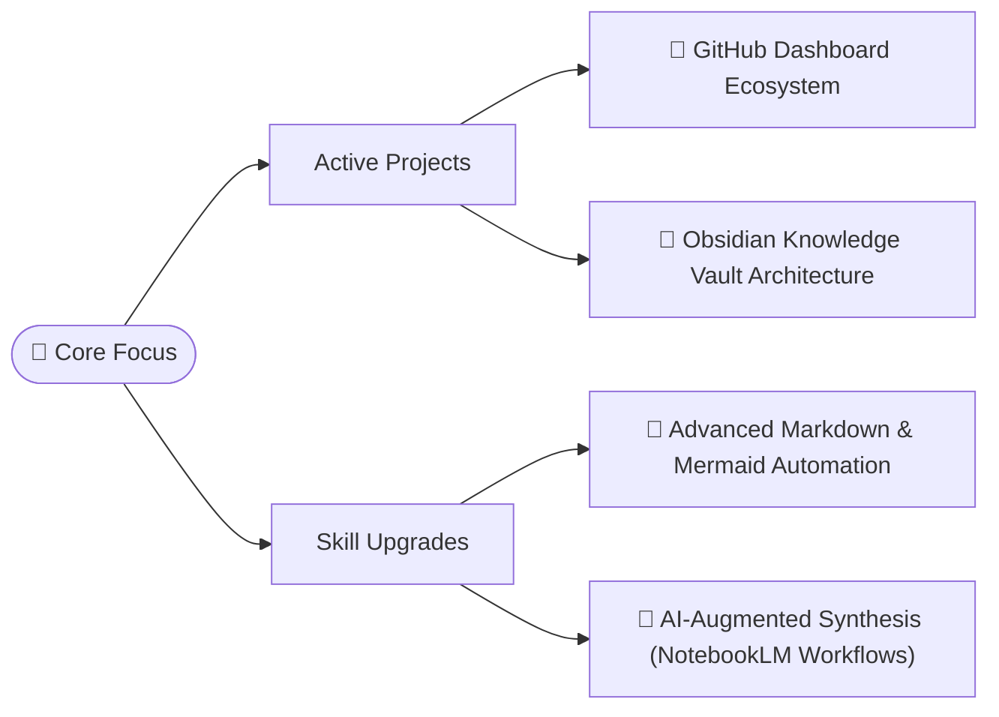

<!--
**boblbell/boblbell** is a ✨ _special_ ✨ repository because its `README.md` (this file) appears on your GitHub profile.

Here are some ideas to get you started:

- 🔭 I’m currently working on ...
- 🌱 I’m currently learning ...
- 👯 I’m looking to collaborate on ...
- 🤔 I’m looking for help with ...
- 💬 Ask me about ...
- 📫 How to reach me: ...
- 😄 Pronouns: ...
- ⚡ Fun fact: ...
-->

# Hello there! :floppy_disk:

  

  
  

I am a passionate Cybersecurity Engineer and knowledge architect focused on building clean, efficient, and highly connected digital ecosystems. I specialize in turning complex data fragmentation into streamlined, actionable workflows.

---

## 🛠 My Current Knowledge and Growth Path:

<table align="center">
<tr>
<td valign="top" width="50%" align="center">

##### 👨‍💻 Programming & Scripting

##### 💻 Operating Systems & Virtualization

##### ☁️ Cloud Platforms

</td>
<td valign="top" width="50%" align="center">

##### 🛡️ Security Tools & Frameworks

##### ⚙️ DevOps & Other Tools

</td>
</tr>
</table>
---

## 🚀 Current Focus Ecosystem

This is how I am currently dividing my development energy across my active projects:

## 🔗 Connections
- [My LinkedIn Profile](https://www.linkedin.com/in/boblbell/)
- [My Certifications](https://www.credly.com/users/bob-bell/badges/credly)
- [My Education]()

